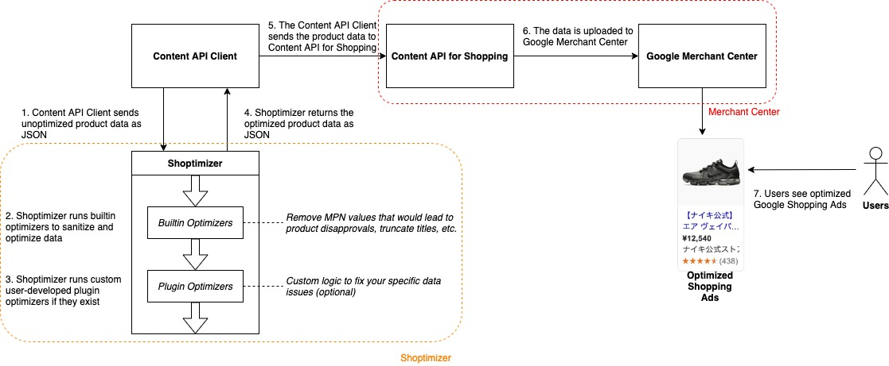

# Shoptimizer API Developer Guide

_Copyright 2019 Google LLC. This solution, including any related sample code or
data, is made available on an “as is,” “as available,” and “with all faults”
basis, solely for illustrative purposes, and without warranty or representation
of any kind. This solution is experimental, unsupported and provided solely for
your convenience. Your use of it is subject to your agreements with Google, as
applicable, and may constitute a beta feature as defined under those agreements.
To the extent that you make any data available to Google in connection with your
use of the solution, you represent and warrant that you have all necessary and
appropriate rights, consents and permissions to permit Google to use and process
that data. By using any portion of this solution, you acknowledge, assume and
accept all risks, known and unknown, associated with its usage, including with
respect to your deployment of any portion of this solution in your systems, or
usage in connection with your business, if at all._

- [Shoptimizer API Developer Guide](#shoptimizer-api-developer-guide)
  * [About](#about)
  * [1. Prerequisites](#1-prerequisites)
  * [2. Architecture Overview](#2-architecture-overview)
    + [2.1 Shoptimizer Workflow](#21-shoptimizer-workflow)
    + [2.2 API Specification](#22-api-specification)
    + [2.3 Example Usage](#23-example-usage)
  * [3. Config Files](#3-config-files)
  * [4. Integrating Shoptimizer with your Content API Client](#4-integrating-shoptimizer-with-your-content-api-client)
    + [4.1 Authentication](#41-authentication)
    + [4.2 Calling Shoptimizer](#42-calling-shoptimizer)
    + [4.3 Recommended Order to Run Optimizers](#43-recommended-order-to-run-optimizers)
    + [4.4 Parsing the Response](#44-parsing-the-response)
    + [4.5 Checking for Errors](#45-checking-for-errors)
      - [4.4.1 Bad Requests](#451-bad-requests)
      - [4.4.2 Optimizer Errors](#452-optimizer-errors)
    + [4.6 Complete Code Sample](#46-complete-code-sample)
  * [5. Excluding Optimizers for Specific Items](#5-excluding-optimizers-for-specific-items)
  * [6. Writing a Plugin](#6-writing-a-plugin)
    + [6.1 Create a New Module](#61-create-a-new-module)
    + [6.2 Implement from BaseOptimizer](#62-implement-from-baseoptimizer)
    + [6.3 Install MeCab](#63-install-mecab)
    + [6.4 Run Unit Tests](#64-run-unit-tests)
    + [6.5 Update Shoptimizer](#65-update-shoptimizer)
  * [7. Tracking Optimization Performance](#7-tracking-optimization-performance)
    + [7.1 Log the Shoptimizer Response](#71-log-the-shoptimizer-response)
    + [7.2 View customLabel Fields in Google Ads](#72-view-customlabel-fields-in-google-ads)
  * [8. Run Unit Tests](#8-run-unit-tests)

## 0. About

This document explains how to integrate the Shoptimizer API (referred to as
'Shoptimizer') with your existing Content API for Shopping solution. It also
describes the technical architecture, how to create or custom optimizations, and
how to track optimization performance.

For an explanation of how to pull the source code and run Shoptimizer, see the
[install guide](./install-guide.md).

## 1. Prerequisites

*   The Shoptimizer source code (see the [install guide](./install-guide.md))
*   A Python 3.8+ environment

## 2. Architecture Overview

### 2.1 Shoptimizer Workflow



### 2.2 API Specification

Shoptimizer consists of a single endpoint called `optimize`, which is documented
below.

--------------------------------------------------------------------------------

__optimize__

**URL**

`/batch/optimize`

**Method**

`POST`

**URL Query Params**

_**Required:**_

*   (None)

_**Optional:**_

*   `lang=[en/ja]`
*   `country=[us/jp]`
*   `currency=[usd/jpy]`
*   `adult-optimizer=(true/false)`
*   `color-length-optimizer=(true/false)`
*   `condition-optimizer=(true/false)`
*   `description-optimizer=(true/false)`
*   `free-shipping-optimizer=(true/false)`
*   `identifier-exists-optimizer=(true/false)`
*   `image-link-optimizer=(true/false)`
*   `invalid-chars-optimizer=(true/false)`
*   `mpn-optimizer=(true/false)`
*   `product-type-length-optimizer=(true/false)`
*   `promo-text-removal-optimizer=(true/false)`
*   `shopping-exclusion-optimizer=(true/false)`
*   `size-length-optimizer=(true/false)`
*   `title-length-optimizer=(true/false)`
*   `title-optimizer=(true/false)`
*   `title-word-order-optimizer=(true/false)`

"lang" will control which language is used for certain optimizers that require
language-specific token parsing. The supported language values are: "en"
(English), "ja" (Japanese). If the "lang" parameter is not supplied, it will
default to English. This directly maps to which language-specific config file
is used under the config/ directory. These files can be edited by the user as
needed.

"country" and "currency" will control which country and currency are used for
certain optimizers that set country-specific and currency-specific value. The
default value is "us" for "country" and "usd" for "currency".

Apart from "lang", "country" and "currency", setting any of the other parameters
to true will run the associated optimizer. If any of these parameters are not
provided in the request, they will default to false.

See the [OptimizerExplanations](../README.md#2-optimizer-explanations) section
in the README for a description of the available optimizers, and refer to
[section 4.3](./developer-guide.md#43-recommended-optimizer-order) 'Recommended
Order to Run Optimizers' for running multiple optimizers in sequence.

**Request Body**

The request body should contain a JSON payload of product data in the same
format as a Content API for Shopping
[products.custombatch](https://developers.google.com/shopping-content/reference/rest/v2.1/products/custombatch)
call.

**Success Response**

*   **Code:** 200 <br />
    **Content:**
    `json
    {
        "optimization-results": {
            "optimizer-name": {
                "error_msg": "",
                "num_of_products_optimized": 0,
                "result": "{success/failure}"
            },
        },
        "optimized-data": {
            ...optimized product batch data...
        },
        "plugin-results": {
            "plugin-name": {
                "error_msg": "",
                "num_of_products_optimized": 0,
                "result": "{success/failure}"
            }
        }
    }`

**Error Response**

*   **Code:** 404 NOT FOUND <br />
    **Content:**
    `json
    {
      "error": "URL not found"
    }`

    OR

*   **Code:** 400 BAD REQUEST <br />
    **Content:**
    `json
    {
      "error-msg": "Error msg.",
      "optimization-results": {},
      "optimized-data": {},
      "plugin-results": {}
    }`

--------------------------------------------------------------------------------

### 2.3 Example Usage

The following file can be imported into [Postman](https://www.postman.com/) to
create a suite of example HTTP requests:

`/shoptimizer/shoptimizer_api/postman/shoptimizer_integration_tests.postman_collection.json`

Within the Postman suite, the `{{baseApiUrl}}` environment variable can be set
to a local host or remote host, such as a Google Cloud Run URL.

Postman can also be used to
[generate code snippets](https://learning.postman.com/docs/postman/sending-api-requests/generate-code-snippets/)
for use within your Content API Client.

## 3. Config Files

***Warning: If the below config files are changed to not follow the specified
structure or key names, the corresponding optimizers may stop functioning.***

In order for some of the optimizations (shown below) to have any effect,
configuration files located in shoptimizer_api/config must be correctly set to
your specific business requirements. With the exception of the
"brand_blocklist.json" config file, the filename of each config must be suffixed
with "\_{lang}", where {lang} is the ISO 639-2 language code that your request's
"lang" parameter specifies. Each config file is explained in the table below.

Config File Name                       | Used by Optimizer(s)                   | How to Configure
-------------------------------------- | -------------------------------------- | ----------------
adult_optimizer_config_{lang}.json     | adult-optimizer                        | Set the \"**adult_product_types**\" section to a list of strings representing adult-oriented [Product Types](https://support.google.com/merchants/answer/6324406?hl=en). Do not use the fully qualified path of the entire Product Types string, but instead only put individual types into each entry in this config section (e.g. only look for "Dresses", not "Home > Women > Dresses > Maxi Dresses"). Set the \"**adult_google_product_categories**\" section to a list of key-value pairs, the key being any full [Google Product Category](https://support.google.com/merchants/answer/6324436?hl=en) (the optimizer can match any sub-category of an upper-tier), and the value a list of strings representing tokens that will indicate the product is adult-oriented. Setting the value to a single-element list with the token "\*" will flag the entire GPC as adult-oriented. The optimizer will then check if the product is either of an adult-oriented Product Type, OR an adult-oriented GPC that contains adult-oriented tokens to set the adult attribute. See the default configs for examples.
brand_blocklist.json                   | title-optimizer, description-optimizer | Add a list of strings representing brands that should not be appended to the title or description of the product. See the default configs for examples.
color_optimizer_config_{lang}.json     | title-optimizer, description-optimizer | Set \"**color_terms**\" to a dictionary of key-value pairs representing colors to be mined and map complex colors to simple colors. Complex colors get appended to title/description, and simple colors get added to the color field. See the default configs for examples.
condition_optimizer_config_{lang}.json | condition-optimizer                    | Set the \"**used_tokens**\" section to a list of string representing tokens in a product's title or description that indicate if a product should be set to "Used". Set the \"**excluded_product_categories**\" section to a list of strings representing any full [Google Product Category](https://support.google.com/merchants/answer/6324436?hl=en) (the optimizer can match any sub-category of an upper-tier) that should exclude this optimizer from checking for tokens in the used_tokens section. Set the \"**target_product_categories**\" section to a list of key-value pairs, the key being any full [Google Product Category](https://support.google.com/merchants/answer/6324436?hl=en) (the optimizer can match any sub-category of an upper-tier), and the value a list of strings representing tokens that will indicate the product is Used. This is useful for category-specific tokens. See the default configs for examples.
free_shipping_optimizer_config_{lang}.json    | free-shipping-optimizer | Set the \"**free_shipping_patterns**\" section to a list of regex strings representing text that indicates the product is being offered with free shipping. Set the \"**shipping_exclusion_patterns**\" section to a list of regex strings that indicate any exceptions to a product's free shipping status. For example, any specific geographic areas that cannot be offered with free shipping, but otherwise free shipping would apply on that product.
gender_optimizer_config_{lang}.json    | title-optimizer, description-optimizer | Set the \"**adult_product_categories**\" section to a list of strings representing partial [Google Product Categories](https://support.google.com/merchants/answer/6324436?hl=en) (any part of a tier can match a product's category) that indicate products in those categories should be mined for adult genders. Similarly, set the \"**baby_product_categories**\" to a list of partial GPCs that indicate products in those categories should be mined for baby genders. The next three sections, "female", "male", and "unisex" specify the terms to search the [Product Type](https://support.google.com/merchants/answer/6324406?hl=en) field and description for, and the \"**\*__replacement**\" fields specify the desired terms to set as the gender in the title (for either "baby" or "adult" types of products). See the default configs for examples.
gpc_string_to_id_mapping_{lang}.json    | title-word-order-optimizer | An inverse version of the Google Product Category taxonomy mapping for the purpose of converting string representations of GPCs into their ID number counterparts. This config should be static and not need manual modification unless the taxonomy changes.
image_link_optimizer_config.json       | image-link-optimizer                   | \"**require_image_can_be_downloaded**\" (bool, Default=True) If True, image URLs must be accessible over the internet by this optimizer; image file size is also validated. This requires network access to work. If False, do not try to download this image. \n \"**require_image_score_quality_better_than**\" (float, Default=0.9) Consider images likely to be disapproved if their quality score is worse than this value. Requires images to be downloaded. Normal scores range from 0.0 (best) to 1.0 (worst). See the documentation for [Image Link Optimizer](./image-link-optimizer.md) for details.
promo_text_removal_optimizer_config_{lang}.json  | promo-text-removal-optimizer           | Set \"**promotional_text_patterns_regex**\" to a list of strings representing regex patterns that will be matched against the product's title. Set \"**promotional_text_patterns_exact_match**\" to a list of strings representing exact-match patterns that will be matched against the product's title. Matching patterns will be removed from the title.
shopping_exclusion_optimizer_config_{lang}.json  | shopping-exclusion-optimizer           | Set \"**shopping_exclusion_patterns_exact_match**\" to a list of strings representing text that will be matched against the product's title. If the title contains any of these terms, the optimizer will exclude the product from Shopping ads in the Content API request.
title_word_order_blocklist_{lang}.json | title-word-order-optimizer | Add words into the string array that will prevent the title-word-order-optimizer from moving those words to the front of product titles, even if they are determined to be high-performing.
title_word_order_config_{lang}.json  | title-word-order-optimizer           | _This config is specifically designed to work with a Word-Mix-Model output config file format. See the document on [Title Word Order Optimizer](./title-word-order-optimizer.md) for details._ The format is: a dictionary of Google Product Category (GPC) IDs each mapped to a list of dictionaries containing: 1. high-performing title keywords and 2. their associated weight. Thus, only products within the matching GPC will have their titles optimized if possible.
title_word_order_options.json | title-word-order-optimizer | See the document on [Title Word Order Optimizer](./title-word-order-optimizer.md) for details. Configures flags and settings for the title-word-order-optimizer behavior.

## 4. Integrating Shoptimizer with your Content API Client

This section explains how to call Shoptimizer from your Content API Client. It
assumes you already have Shoptimizer running on your chosen infrastructure. If
you do not have Shoptimizer running yet, see the
[install guide](./install-guide.md).

The code samples in this section are written in Python, but any language which
is capable of sending HTTP requests can call Shoptimizer. The code samples do
not contain error handling for the sake of clarity, but production code should
also handle error conditions, such as network issues.

### 4.1 Authentication

Make sure you are authenticated with the Docker host where the Shoptimizer
container is running. Authentication will depend on the platform you are using
to host the Shoptimizer container. See the documentation for your chosen Docker
host for details on how to authenticate.

If you are running Shoptimizer with Google Cloud Run, you can get a JWT for
authentication, shown below.

__Example Code to Get a Cloud Run JWT__

```python
# Replace [SHOPTIMIZER-BASE-URL] with your Shoptimizer base URL
token_request_url = f'http://metadata/computeMetadata/v1/instance/service-accounts/default/identity?audience=[SHOPTIMIZER--BASE-URL]'
token_request_headers = {'Metadata-Flavor': 'Google'}

# Fetches the token
response = requests.get(token_request_url, headers=token_request_headers)
jwt = response.content.decode('utf-8')
```

### 4.2 Calling Shoptimizer

The Shoptimizer endpoint is constructed as follows:

[POST]`{HOST}:{PORT}/shoptimizer/v1/batch/optimize?{OPTIMIZATION-QUERY-STRING}`

The body should contain a batch of product data encoded as JSON, in the same
format as
[products.custombatch](https://developers.google.com/shopping-content/reference/rest/v2.1/products/custombatch).

`OPTIMIZATION-QUERY-STRING` is a list of query parameters in the format
`{optimizer-key}={true/false}` that determines which optimizers Shoptimizer will
run. __The order of these query string parameters determines which
order the optimizers will be run, from left to right. See [section 4.3](./developer-guide.md#43-recommended-optimizer-order) for the default recommended order if you are running multiple optimizers.__

Append `optimizer-key=true` as a URL parameter in your call to Shoptimizer for
each optimizer you want to run.

For example, to run the mpn-optimizer and title-optimizer, use the following
endpoint:

`.../shoptimizer/v1/batch/optimize?mpn-optimizer=true&title-optimizer=true`

See [section 2.2](./developer-guide.md#22-api-specification) for a list of available default optimizer keys.

If you don't specify an optimizer in the query string, it will not
be run, unless an item in the body specifies that it should be excluded.
See [section 5](./developer-guide.md#22-api-specification#5-excluding-optimizers-for-specific-items) 'Excluding Optimizers for Specific Items' for details.

Consider creating a config file for your Content API client so that you can
easily toggle optimizers on and off.

__Example Endpoint__

`http://0.0.0.0:8080/shoptimizer/v1/batch/optimize?mpn-optimizer=true&title-length-optimizer=true`

__Example Code to Call Shoptimizer__

```python
# Converts a batch of product data from a Python dictionary to a JSON string
product_batch_json = json.dumps(original_product_batch_dictionary)

# Sets up a dictionary to specify which optimizers to run
optimizers_to_run = {
  'mpn-optimizer': 'true'
  'title-length-optimizer': 'true'
  }

# Makes the call to Shoptimizer
headers = {
          'Authorization': f'bearer {jwt}',
          'Content-Type': 'application/json'
        }

response = requests.request(
      'POST',
      '[SHOPTIMIZER-BASE-URL]/shoptimizer/v1/batch/optimize', # Replace [SHOPTIMIZER-BASE-URL] with your Shoptimizer base URL
      data=product_batch_json,
      headers=headers,
      params=optimizers_to_run)
```

### 4.3 Recommended Order to Run Optimizers

In the case that multiple or all optimizers are turned on in the request, in
this section we provide a recommended order that the optimizers can be run in.
Since this is only a suggestion, the order could be changed if needed, but care
should be taken to account for dependencies in the changes in data.

__1. mpn-optimizer__

Recommended to be run before identifier-exists-optimizer (see below for reasoning).


__2. identifier-exists-optimizer__

This can run after mpn optimization, because even though mpn can be changed, it is recommended to first optimize that attribute to correctly reflect how identifier-exists should behave.


__3. invalid-chars-optimize__

This modifies description and title, but should be run earlier in order for title-optimizer, description-optimizer, etc. to operate on pre-sanitized data.


__4. condition-optimizer__

This checks title and description, but should be run before the title and description optimizers so that it makes decisions about the condition, based on the user-provided text, rather than post-modified text which could result in unexpected results.


__5. adult-optimizer__

Same reasoning as condition-optimizer.


__6. color-length-optimizer__

Color and size are mined before optimizers are run, so order won’t matter.


__7. size-length-optimizer__

Color and size are mined before optimizers are run, so order won’t matter.


__8. product-type-length-optimizer__

This is not used as a mined attribute, however, this should be run after adult-optimizer, since that optimizer may need to check values in productTypes before any truncation happens via this optimizer. Also, while title and description optimizers do use the productTypes attribute, since their logic is based on its mined copy, the order will not depend on title or description optimizers.


__9. description-optimizer__

This is OK to run before the length optimizers since those don’t affect this optimizer.


__10. title-optimizer__

This is OK to run before the length optimizers since those don’t affect this optimizer.


__11. title-length-optimizer__

This is a subset of title-optimizer, so it would be recommended to be used if title-optimizer was not used, and only if the user deems it necessary to fix long titles.

__12. image-link-optimizer__

No other optimizers affect the imageLink or additionalImageLink attributes, so order does not matter.

__13. title-word-order-optimizer__

This specific optimizer will be forced to be the last to run despite its order in the query string parameters.


### 4.4 Parsing the Response

A successful call to Shoptimizer will return a `200` HTTP status code and JSON
in the following format:

```json
{
    "optimization-results": {
        "optimizer-name": {
            "error_msg": "",
            "num_of_products_optimized": 0,
            "result": "{success/failure}"
        },
    },
    "optimized-data": {
        ...optimized product batch...
    },
    "plugin-results": {
        "plugin-name": {
            "error_msg": "",
            "num_of_products_optimized": 0,
            "result": "{success/failure}"
        }
    }
}

```

The JSON contains three parts:

*   __optimized-data__: The optimized product batch. This can be sent to Content
    API for Shopping.

*   __optimization-results__: A list of the results for each built-in optimizer
    in the format `optimizer-name: {result-dictionary}`. This can be read to
    track the performance and detect errors that occurred within each optimizer.
    The resulting dictionary for each optimizer is in the following format:

    *   _error_msg_: Empty if no error occurred while running the optimizer,
        otherwise an error message.
    *   _num_of_products_optimized_: The number of products that were affected
        by this optimizer.
    *   _result_: `success` if the optimizer finished running without errors, or
        `failure` otherwise.

*   __plugin-results__: A list of the results for each plugin optimizer in the
    format `plugin-name: {result-dictionary}`. This can be read to track the
    performance and detect errors that occurred within plugins. The result
    dictionary for each plugin is in the following format:

    *   _error_msg_: Empty if no error occurred while running the plugin,
        otherwise an error message.
    *   _num_of_products_optimized_: The number of products that were affected
        by this plugin.
    *   _result_: `success` if the plugin finished running without errors,
        otherwise `failure`.

To get the optimized product batch, parse out `optimized-data` from the
response.

__Example Code to Parse Shoptimizer Response__

```python
# Parses the JSON response data
shoptimizer_response_dict = json.loads(response.text)

# Parses out the optimized product batch
optimized_product_batch = shoptimizer_response_dict.get('optimized-data')
```

### 4.5 Checking for Errors

#### 4.5.1 Bad Requests

If Shoptimizer receives a bad request, it will return a `400` HTTP response code
and JSON in the following format:

```json
{
    "error-msg": "Descriptive error message.",
    "optimization-results": {},
    "optimized-data": {},
    "plugin-results": {}
}

```

__Example Code to Check for Errors__

```python
# Checks for top level errors in the Shoptimizer API response, and returns the original product batch if any encountered
if shoptimizer_response_dict.get('error-msg', ''):
  logging.error('Encountered an error in the Shoptimizer API response', response_dict['error-msg'])
  return original_product_batch_dictionary
```

#### 4.5.2 Optimizer Errors

Each optimizer runs within an isolation block that will prevent the Shoptimizer
container from crashing if an unexpected error is encountered. This means that
an individual optimizer may encounter an error, but Shoptimizer can still return
a successful response since other optimizers ran without errors. If an optimizer
encounters an unexpected error, it will return an unmodified product batch, so
there is no need to worry about unexpected optimizer errors causing data
corruption.

To check if an optimizer encountered an unexpected error, parse the
`optimization-results` and `plugin-results` from the Shoptimizer API response.

__Example Code to Check Optimizer Results__

```python
# Checks for any errors that occurred within individual optimizers.
optimization_results = response_dict.get('optimization-results', '')

for optimizer_name, optimizer_results in optimization_results.items():
      if optimizer_results.get('result', '') == 'failure':
        logging.error('optimizer %s enountered an error: %s', optimizer_name,  optimizer_results.get('error_msg'))

```

### 4.6 Complete Code Sample

```python
def shoptimize(original_product_batch_dictionary: Dict[str, Any]) -> Dict[str, Any]:
  """Optimizes a batch of product data by sending it to the Shoptimizer (optimization) API.

  Args:
    original_product_batch_dictionary: The batch of product data to be optimized.

  Returns:
    The optimized batch of product data if no errors encountered,
    or the original batch of product data otherwise.
  """

  # Converts a batch of product data from a Python dictionary to a JSON string
  product_batch_json = json.dumps(original_product_batch_dictionary)

  # Sets up a dictionary to specify which optimizers to run
  optimizers_to_run = {
    'mpn-optimizer': 'true'
    'title-length-optimizer': 'true'
    }

  # Makes the call to Shoptimizer
  headers = {
            'Authorization': f'bearer {jwt}',
            'Content-Type': 'application/json'
          }

  response = requests.request(
        'POST',
        '[SHOPTIMIZER-URL]/shoptimizer/v1/batch/optimize', # Replace [SHOPTIMIZER-URL] with your Shoptimizer URL
        data=product_batch_json,
        headers=headers,
        params=optimizers_to_run)

  # Parses the JSON response data
  shoptimizer_response_dict = json.loads(response.text)

  # Checks for top level errors in the Shoptimizer API response, and returns the original product batch if any encountered
  if shoptimizer_response_dict.get('error-msg', ''):
    logging.error('Encountered an error in the Shoptimizer API response', response_dict['error-msg'])
    return original_product_batch_dictionary

  # Checks for any errors that occurred within individual optimizers.
  optimization_results = response_dict.get('optimization-results', '')

  for optimizer_name, optimizer_results in optimization_results.items():
        if optimizer_results.get('result', '') == 'failure':
          logging.error('optimizer %s enountered an error: %s', optimizer_name,  optimizer_results.get('error_msg'))

  # Parses out the optimized product batch and returns it
  return shoptimizer_response_dict.get('optimized-data')
```

## 5. Excluding Optimizers for Specific Items
In the request body's list of entries, it is possible to set for each entry a special (optional) attribute called `excludeOptimizers` that allows the specified optimizers in that attribute to be skipped over only for that specific entry.

`excludeOptimizers` can be added to the top level of each entry in the request body as a comma-separated list of optimizer query strings.

An example request to exclude one optimizer would look like:

```
{
    "entries": [
        {
            "batchId": 1,
            "merchantId": 1234567,
            "method": "insert",
            "excludeOptimizers": ["promo-text-removal-optimizer"],
            "product": {
               ...
            }
        }
    ]
}
```

The result would be that even if the request's query string contained "promo-text-removal-optimizer=true", e.g.:

`.../shoptimizer/v1/batch/optimize?promo-text-removal-optimizer=true&title-optimizer=true`

then the `promo-text-optimizer` would not be applied to that specific product, but the `title-optimizer` would be applied as normal.

Importantly, the returned Shoptimizer API response will never contain `excludeOptimizers` attributes in the entries, so that the desired Content API format will be unaffected.

This will allow, if desired, for more granular control of a batch request, in the case that some specific products in that request are not intended to be processed through a subset of the request query's optimizers list.

Additionally, the number of excluded items is logged per optimizer. In the case of Cloud Run, this will be shown in Cloud Logging.

## 6. Writing a Plugin

If you want to add your own sanitization and optimization code to Shoptimizer,
you can write a plugin to do this.

To create a plugin, open the Shoptimizer solution and follow the steps below.

_Note: See `shoptimizer_api/optimizers_plugins/my_plugin.py` for an example
plugin. You can copy this plugin and then update the `optimize` method to
contain your own specific logic._

### 6.1 Create a New Module

In the `shoptimizer_api/optimizers_plugins` directory, create a new Python
module.

There is no required naming convention for plugin optimizers, but it is
recommended to use the format `{optimization-description}_plugin.py`.

### 6.2 Implement from BaseOptimizer

Your plugin should inherit from `base_optimizer.BaseOptimizer`.

This requires implementing:

*   __`_OTPIMIZER_PARAMETER`__: A class attribute that can be used to enable or
    disable your plugin.
*   __`optimize(self, data: Dict[str, Any]) -> int`__: The entrypoint for
    optimization logic. This method takes in a batch of product data and returns
    the number of products affected by the optimizer.

Since your plugin will be dynamically loaded into Shoptimizer, you do not need
to (and should not) change any of the Shoptimizer code outside of your plugin.

__Sample Plugin__

```python
from typing import Any, Dict

from optimizers_abstract import base_optimizer


class MyPlugin(base_optimizer.BaseOptimizer):
  """An example plugin."""

  _OPTIMIZER_PARAMETER = 'my-plugin'

  def optimize(self, data: Dict[str, Any]) -> int:
    """The entrypoint for optimization logic.

    Args:
      data:  A dictionary containing product data.

    Returns:
      The number of products affected by this optimization: int
    """
    num_of_products_optimized = 0

    for entry in data['entries']:
      product = entry['product'] # Grabs the product
      product['title'] = 'Optimized Title' # Sets the title to some optimized value
      num_of_products_optimized = num_of_products_optimized + 1 # Increments the number of products optimized
      base_optimizer.set_optimization_tracking(entry, base_optimizer.OPTIMIZED) # Sets optimization tracking

    return num_of_products_optimized

```

### 6.3 Install MeCab

Shoptimizer uses MeCab, a natural language processing tool that tokenizes
Japanese text. Install it before running unit tests. If you do not want to run
the unit tests, you do not have to install MaCab

OSX:

```
brew install mecab mecab-ipadic git curl xz
git clone --depth 1 https://github.com/neologd/mecab-ipadic-neologd.git
echo yes | mecab-ipadic-neologd/bin/install-mecab-ipadic-neologd -n -a
```

Linux:

```
apt-get update
apt-get -y install mecab libmecab-dev mecab-ipadic-utf8 git make curl xz-utils file sudo
git clone --depth 1 https://github.com/neologd/mecab-ipadic-neologd.git
echo yes | mecab-ipadic-neologd/bin/install-mecab-ipadic-neologd -n -a
```

### 6.4 Run Unit Tests

Run Python unit test module to test optimizers. For example, when you test
title_optimizer, run the command below:

```
python -m unittest optimizers_builtin.title_optimizer_test
```

### 6.5 Update Shoptimizer

After creating your plugin, follow the [install guide](./install-guide.md) to
redeploy the updated Shoptimizer.

You can call your new Plugin from your Content API Client by appending the
`{_OPTIMIZER_PARAMETER}=true` value to the end of the query string. For example,
to call the sample plugin above:

`{HOST}:{PORT}/shoptimizer/v1/batch/optimize?my-plugin=true`

## 7. Tracking Optimization Performance

There are two ways to track the performance of optimized products:

1.  Log the Shoptimizer response
2.  View customLabels in Google Ads

### 7.1 Log the Shoptimizer Response

The Shoptimizer response contains a list of results for each optimizer. Each
optimizer result contains a field `num_of_products_optimized` that contains a
count of the number of products that were affected. Log or store this result on
your infrastructure to keep track of how effective specific optimizers are.

See [Section 4.4](./developer-guide.md#44-parsing-the-response) 'Parsing the Response'
for details on the format of the Shoptimizer response.

### 7.2 View customLabel Fields in Google Ads

If you configured the `PRODUCT_TRACKING_FIELD` environment variable, optimized
products will have one of 3 values set in their customLabel field:

-   __SANITIZED__: Invalid data was removed or corrected. If this had not been
    done the product would have been disapproved.
-   __OPTIMIZED__: Data was modified in an attempt to improve performance, but
    the original data was not incorrect.
-   __SANITIZED_AND_OPTIMIZED__: The product was both sanitized and optimized.

You can filter by these values in Google Ads to view data about the performance
of the optimized products.

See section 2.3.3 'Run the Container' in the [install guide](./install-guide.md#233-run-the-container) for details on configuring the environment variables.

## 8. Run Unit Tests

First, all the necessary python dependencies need to be installed. You can
 use pipenv and run:
```
pipenv --python 3
pipenv shell
pipenv install --dev
```
From the pipenv virtual environment, you can now run all of the unit tests in
 the solution by running `python test_runner.py`.
